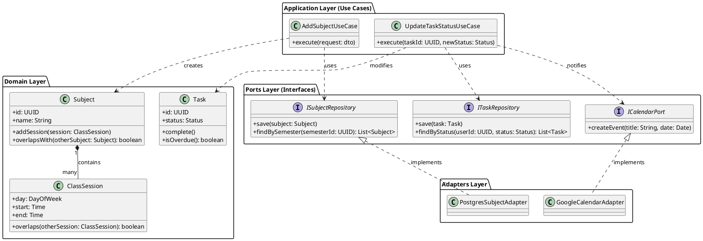

# Domain Model & CRC Cards

## CRC Cards (Class-Responsibility-Collaborator)

### 1. Subject (Aggregate Root)
| **Class Name:** Subject                  | **Parent:** Entity |
| :--------------------------------------- | :----------------- |
| **Responsibilities**                     | **Collaborators**  |
| Maintain course details (name, credits). | ClassSession       |
| Manage list of weekly sessions.          | Semester           |
| Calculate total weekly hours.            |                    |
| Update difficulty/stats.                 |                    |

### 2. ClassSession (Entity)
| **Class Name:** ClassSession                      | **Parent:** Entity |
| :------------------------------------------------ | :----------------- |
| **Responsibilities**                              | **Collaborators**  |
| Store time and location of a single class blocks. | Subject            |
| Validate time integrity (start < end).            |                    |

### 3. ScheduleService (Domain Service)
| **Class Name:** ScheduleService                              | **Parent:** Service |
| :----------------------------------------------------------- | :------------------ |
| **Responsibilities**                                         | **Collaborators**   |
| Add new subject to semester.                                 | SubjectRepository   |
| **Detect time conflicts** between new and existing sessions. | Subject             |
| Calculate semester workload (total credits).                 | SemesterRepository  |

### 4. TaskService (Domain Service)
| **Class Name:** TaskService                      | **Parent:** Service |
| :----------------------------------------------- | :------------------ |
| **Responsibilities**                             | **Collaborators**   |
| Create tasks and link to subjects.               | TaskRepository      |
| Move tasks through Kanban states (Todo -> Done). | Task                |
| Sync High Priority items to Calendar.            | ICalendarPort       |

## Domain Class Diagram (PlantUML)

This diagram illustrates how the Domain Entities interact with Use Cases and Interfaces, strictly following the dependency rule (inner layers do not depend on outer layers).

