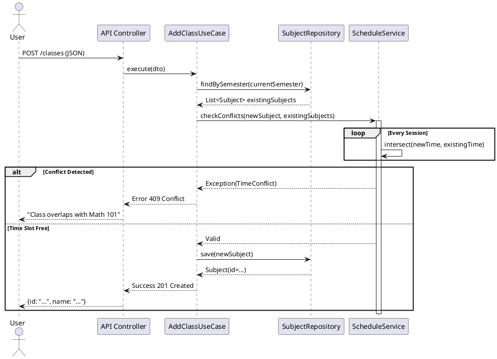
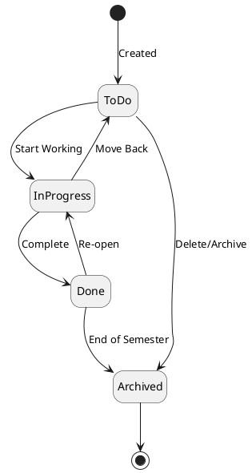

# Behavioral Diagrams (PlantUML)

## Sequence Diagram: Adding a Class with Conflict Detection

This flow demonstrates the "Resilient Pragmatism" approach: validation happens in the core domain before hitting the database.

## State Diagram: Task Lifecycle

The lifecycle of a Task entity, illustrating valid transitions for the Kanban board.

