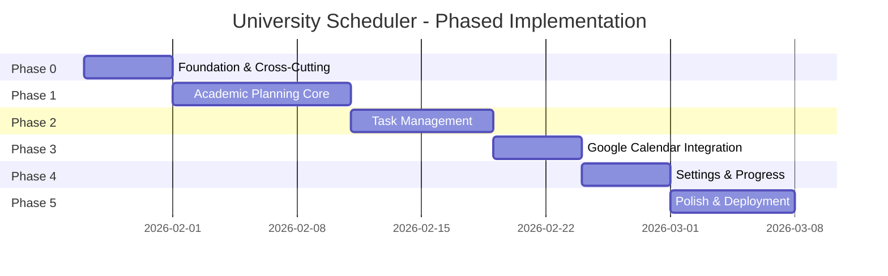
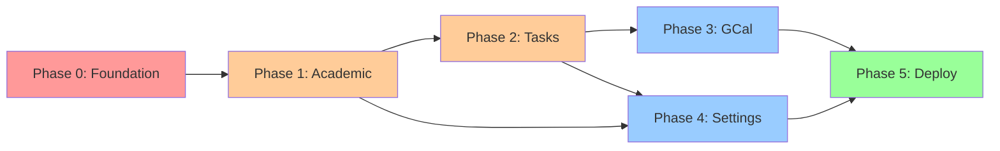

# University Scheduler - Phased Implementation Plan (v2 - Complete PUML Analysis)

## Document Analysis Summary

### PUML Diagrams Analyzed

| Category | Diagram | Key Insights |
|----------|---------|--------------|
| **C4** | [01_system_context.puml](file:///home/blend-pc-juan/Documentos/Proyecto%20Personal/UniversityScheduler/docs/diagrams/c4/01_system_context.puml) | 3 external systems: Google Calendar, University Portal (future) |
| **C4** | [02_container.puml](file:///home/blend-pc-juan/Documentos/Proyecto%20Personal/UniversityScheduler/docs/diagrams/c4/02_container.puml) | 3-tier: Next.js → FastAPI → PostgreSQL |
| **C4** | [03_component.puml](file:///home/blend-pc-juan/Documentos/Proyecto%20Personal/UniversityScheduler/docs/diagrams/c4/03_component.puml) | Hexagonal: Domain Core, Ports, Adapters with specific services |
| **C4** | [frontend_components.puml](file:///home/blend-pc-juan/Documentos/Proyecto%20Personal/UniversityScheduler/docs/diagrams/c4/frontend_components.puml) | Atomic Design: Atoms→Molecules→Organisms→Templates→Pages |
| **Database** | [erd.puml](file:///home/blend-pc-juan/Documentos/Proyecto%20Personal/UniversityScheduler/docs/diagrams/database/erd.puml) | 6 entities with relationships (1:1 settings, 1:N others) |
| **Behavioral** | [add_class_sequence.puml](file:///home/blend-pc-juan/Documentos/Proyecto%20Personal/UniversityScheduler/docs/diagrams/behavioral/add_class_sequence.puml) | Conflict detection flow with 409 response |
| **Behavioral** | [task_lifecycle_state.puml](file:///home/blend-pc-juan/Documentos/Proyecto%20Personal/UniversityScheduler/docs/diagrams/behavioral/task_lifecycle_state.puml) | 4 states: TODO→InProgress→Done→Archived |
| **Behavioral** | [sync_gcal_sequence.puml](file:///home/blend-pc-juan/Documentos/Proyecto%20Personal/UniversityScheduler/docs/diagrams/behavioral/sync_gcal_sequence.puml) | OAuth flow with external_id storage |
| **Behavioral** | [domain_events.puml](file:///home/blend-pc-juan/Documentos/Proyecto%20Personal/UniversityScheduler/docs/diagrams/behavioral/domain_events.puml) | Event Bus: SubjectCreatedEvent, TaskCompletedEvent with async listeners |
| **Behavioral** | [dfd.puml](file:///home/blend-pc-juan/Documentos/Proyecto%20Personal/UniversityScheduler/docs/diagrams/behavioral/dfd.puml) | 4 main processes: Gestionar Materias/Conflictos/Tareas/Calendario |
| **Architecture** | [error_hierarchy.puml](file:///home/blend-pc-juan/Documentos/Proyecto%20Personal/UniversityScheduler/docs/diagrams/architecture/error_hierarchy.puml) | Exception hierarchy with HTTP mappings (409, 503, 404) |
| **Deployment** | [production_deployment.puml](file:///home/blend-pc-juan/Documentos/Proyecto%20Personal/UniversityScheduler/docs/diagrams/deployment/production_deployment.puml) | Render/Railway 3-tier cloud deployment |
| **Testing** | [testing_strategy.puml](file:///home/blend-pc-juan/Documentos/Proyecto%20Personal/UniversityScheduler/docs/diagrams/testing/testing_strategy.puml) | Pyramid: 60% Unit, 30% Integration, 10% E2E |

### Technology Stack Confirmed
| Layer | Technology | Source |
|-------|------------|--------|
| Backend | FastAPI (Python) | C4 Container |
| Frontend | Next.js (React) | C4 Container |
| Database | PostgreSQL (Supabase) | ADR-003 |
| ORM | SQLAlchemy 2.0 async | ADR-002 |
| Testing | pytest, testcontainers, Playwright | testing_strategy.puml |
| Deployment | Render/Railway + Vercel | production_deployment.puml |

---

## Phase 0: Foundation & Cross-Cutting Concerns
**Duration**: 4-5 days | **Priority**: CRITICAL

### 0.1 Database Migrations & Shared Infrastructure

| File | Description |
|------|-------------|
| `backend/alembic/versions/001_initial_schema.py` | All 6 tables + ENUMs from [erd.puml](file:///home/blend-pc-juan/Documentos/Proyecto%20Personal/UniversityScheduler/docs/diagrams/database/erd.puml) |
| `backend/app/shared/infrastructure/database.py` | Async SQLAlchemy engine, session factory |
| [backend/app/config.py](file:///home/blend-pc-juan/Documentos/Proyecto%20Personal/UniversityScheduler/backend/app/config.py) | Environment config (DATABASE_URL, JWT_SECRET) |

### 0.2 Exception Hierarchy (from [error_hierarchy.puml](file:///home/blend-pc-juan/Documentos/Proyecto%20Personal/UniversityScheduler/docs/diagrams/architecture/error_hierarchy.puml))

| File | Classes |
|------|---------|
| `backend/app/shared/domain/exceptions.py` | `BaseAppException`, `DomainException(entity_id)`, `InfrastructureException(service_name)` |
| `backend/app/shared/domain/exceptions.py` | `ScheduleConflictException` → HTTP 409 |
| `backend/app/shared/domain/exceptions.py` | `InvalidEntityStateException`, `EntityNotFoundException` → HTTP 404 |
| `backend/app/shared/domain/exceptions.py` | `ExternalServiceTimeout`, `DatabaseConnectionError` → HTTP 503 |
| `backend/app/cross_cutting/exception_handler.py` | Global FastAPI exception handler middleware |

### 0.3 Domain Events Infrastructure (from [domain_events.puml](file:///home/blend-pc-juan/Documentos/Proyecto%20Personal/UniversityScheduler/docs/diagrams/behavioral/domain_events.puml))

| File | Description |
|------|-------------|
| `backend/app/shared/domain/events.py` | `DomainEvent` base class, `EventBus` interface |
| `backend/app/shared/infrastructure/event_bus.py` | In-memory `SyncEventBus` implementation |
| Event Types | `SubjectCreatedEvent`, `SemesterActivatedEvent`, `TaskCompletedEvent`, `TaskOverdueEvent` |

### 0.4 Authentication (Users Module)

| File | Description |
|------|-------------|
| `backend/app/modules/users/domain/entities.py` | `User` entity |
| `backend/app/modules/users/application/use_cases.py` | `LoginUseCase`, `RegisterUseCase` |
| `backend/app/modules/users/adapter/router.py` | `POST /api/v1/auth/login`, `POST /api/v1/auth/register` |
| `backend/app/cross_cutting/auth_middleware.py` | JWT validation via `FastAPI Depends` (from [03_component.puml](file:///home/blend-pc-juan/Documentos/Proyecto%20Personal/UniversityScheduler/docs/diagrams/c4/03_component.puml)) |

### 0.5 Frontend Foundation (from [frontend_components.puml](file:///home/blend-pc-juan/Documentos/Proyecto%20Personal/UniversityScheduler/docs/diagrams/c4/frontend_components.puml))

| File | Atomic Level |
|------|--------------|
| `frontend/src/components/atoms/Button.tsx` | Atom |
| `frontend/src/components/atoms/Input.tsx` | Atom |
| `frontend/src/components/atoms/Badge.tsx` | Atom |
| `frontend/src/components/atoms/Icon.tsx` | Atom |
| `frontend/src/components/molecules/FormField.tsx` | Molecule (uses Input + Label) |
| `frontend/src/components/templates/DashboardLayout.tsx` | Template |
| `frontend/src/components/templates/AuthLayout.tsx` | Template |
| `frontend/src/lib/api.ts` | API client with JWT interceptor |
| `frontend/src/features/auth/AuthContext.tsx` | Auth state management |
| `frontend/src/app/(auth)/login/page.tsx` | Login page |

---

## Phase 1: Academic Planning Core
**Duration**: 8-10 days | **Priority**: HIGH  
**PUML References**: [add_class_sequence.puml](file:///home/blend-pc-juan/Documentos/Proyecto%20Personal/UniversityScheduler/docs/diagrams/behavioral/add_class_sequence.puml), [dfd.puml](file:///home/blend-pc-juan/Documentos/Proyecto%20Personal/UniversityScheduler/docs/diagrams/behavioral/dfd.puml) (Process 1.0, 2.0)

### 1.1 Semester Management

| Layer | File | Content |
|-------|------|---------|
| Domain | `modules/academic_planning/domain/entities.py` | `Semester` with date validation |
| Application | `modules/academic_planning/application/use_cases.py` | `CreateSemesterUseCase`, `ActivateSemesterUseCase` |
| Event | Emit `SemesterActivatedEvent` when activating | |
| Port | `modules/academic_planning/port/repository.py` | `ISemesterRepository(ABC)` |
| Adapter | `modules/academic_planning/adapter/postgres_repo.py` | SQLAlchemy implementation |
| API | `POST /api/v1/semesters`, `GET /api/v1/semesters`, `PATCH /api/v1/semesters/{id}` | |

### 1.2 Subject & Session Management

| Layer | File | Content |
|-------|------|---------|
| Domain | `modules/academic_planning/domain/entities.py` | `Subject` with `addSession()`, `overlapsWith()` methods |
| Domain | `modules/academic_planning/domain/entities.py` | `ClassSession` with `overlaps(other)` method |
| Application | `modules/academic_planning/application/use_cases.py` | `AddSubjectUseCase` (as per [add_class_sequence.puml](file:///home/blend-pc-juan/Documentos/Proyecto%20Personal/UniversityScheduler/docs/diagrams/behavioral/add_class_sequence.puml)) |
| Event | Emit `SubjectCreatedEvent` on success | |
| API | `POST /api/v1/subjects`, `GET /api/v1/subjects`, `PATCH`, `DELETE` | |

### 1.3 Conflict Detection Service (UC-003) ⭐

> **Sequence from [add_class_sequence.puml](file:///home/blend-pc-juan/Documentos/Proyecto%20Personal/UniversityScheduler/docs/diagrams/behavioral/add_class_sequence.puml):**
> 1. API → AddClassUseCase.execute(dto)
> 2. UseCase → Repo.findBySemester(current)
> 3. UseCase → ScheduleService.checkConflicts(new, existing)
> 4. **Loop** every session: intersect time ranges
> 5. **Alt** Conflict → Exception(TimeConflict) → HTTP 409
> 6. **Else** → Repo.save() → HTTP 201

| File | Content |
|------|---------|
| `modules/academic_planning/domain/services.py` | `ScheduleService.checkConflicts(newSubject, existingSubjects)` |
| Algorithm | For each `newSession`: if `existingSession.overlaps(newSession)` → raise `ScheduleConflictException` |
| Response 409 | `{"error": "SCHEDULE_CONFLICT", "conflicts": [...], "resolution_options": [...]}` |

### 1.4 Frontend - Schedule Grid (from [frontend_components.puml](file:///home/blend-pc-juan/Documentos/Proyecto%20Personal/UniversityScheduler/docs/diagrams/c4/frontend_components.puml))

| File | Atomic Level |
|------|--------------|
| `frontend/src/components/molecules/ClassCard.tsx` | Molecule |
| `frontend/src/components/organisms/ScheduleGrid.tsx` | Organism (contains ClassCard) |
| `frontend/src/features/schedule/hooks/useSchedule.ts` | Custom hook |
| `frontend/src/app/dashboard/schedule/page.tsx` | Page (uses ScheduleGrid + DashboardLayout) |
| `frontend/src/components/organisms/ClassFormModal.tsx` | Organism (uses FormField) |

---

## Phase 2: Task Management
**Duration**: 6-8 days | **Priority**: HIGH  
**PUML References**: [task_lifecycle_state.puml](file:///home/blend-pc-juan/Documentos/Proyecto%20Personal/UniversityScheduler/docs/diagrams/behavioral/task_lifecycle_state.puml), [dfd.puml](file:///home/blend-pc-juan/Documentos/Proyecto%20Personal/UniversityScheduler/docs/diagrams/behavioral/dfd.puml) (Process 3.0)

### 2.1 Task Lifecycle State Machine (from [task_lifecycle_state.puml](file:///home/blend-pc-juan/Documentos/Proyecto%20Personal/UniversityScheduler/docs/diagrams/behavioral/task_lifecycle_state.puml))

```
[*] --> TODO : Created
TODO --> InProgress : Start Working
TODO --> Archived : Delete/Archive
InProgress --> Done : Complete
InProgress --> TODO : Move Back
Done --> Archived : End of Semester
Done --> InProgress : Re-open
Archived --> [*]
```

| File | Content |
|------|---------|
| `modules/tasks/domain/entities.py` | `Task` with state machine: `start()`, `complete()`, `reopen()`, `archive()` |
| `modules/tasks/domain/entities.py` | `isOverdue()` method, transitions validation |
| Invariant | Cannot go from `TODO` directly to `Done` (must pass through `InProgress`) |

### 2.2 Task Domain Events

| Event | Trigger | Listeners (from [domain_events.puml](file:///home/blend-pc-juan/Documentos/Proyecto%20Personal/UniversityScheduler/docs/diagrams/behavioral/domain_events.puml)) |
|-------|---------|----------|
| `TaskCompletedEvent` | `task.complete()` | `ProgressTrackerListener`, `NotificationListener` |
| `TaskOverdueEvent` | Scheduled job (future) | `NotificationListener` |

### 2.3 Task CRUD & API

| API Endpoint | Use Case |
|--------------|----------|
| `POST /api/v1/tasks` | `CreateTaskUseCase` |
| `GET /api/v1/tasks?status=...&priority=...` | `ListTasksUseCase` with filters |
| `PATCH /api/v1/tasks/{id}` | `UpdateTaskStatusUseCase` (triggers events) |
| `DELETE /api/v1/tasks/{id}` | `DeleteTaskUseCase` |

### 2.4 Frontend - Kanban Board (from [frontend_components.puml](file:///home/blend-pc-juan/Documentos/Proyecto%20Personal/UniversityScheduler/docs/diagrams/c4/frontend_components.puml))

| File | Atomic Level |
|------|--------------|
| `frontend/src/components/molecules/TaskCard.tsx` | Molecule (uses Badge + Icon) |
| `frontend/src/components/organisms/KanbanBoard.tsx` | Organism (uses TaskCard) |
| `frontend/src/components/organisms/TaskFormModal.tsx` | Organism (uses FormField) |
| `frontend/src/features/tasks/hooks/useTasks.ts` | Custom hook |
| `frontend/src/app/dashboard/tasks/page.tsx` | Page (uses KanbanBoard + DashboardLayout) |

**Drag-and-Drop**: `@hello-pangea/dnd` or `dnd-kit` for state transitions.

---

## Phase 3: Google Calendar Integration
**Duration**: 4-5 days | **Priority**: MEDIUM  
**PUML References**: [sync_gcal_sequence.puml](file:///home/blend-pc-juan/Documentos/Proyecto%20Personal/UniversityScheduler/docs/diagrams/behavioral/sync_gcal_sequence.puml), [dfd.puml](file:///home/blend-pc-juan/Documentos/Proyecto%20Personal/UniversityScheduler/docs/diagrams/behavioral/dfd.puml) (Process 4.0)

### 3.1 Calendar Port & Adapter

> **Sequence from [sync_gcal_sequence.puml](file:///home/blend-pc-juan/Documentos/Proyecto%20Personal/UniversityScheduler/docs/diagrams/behavioral/sync_gcal_sequence.puml):**
> 1. TaskService → GoogleCalendarAdapter.createEvent(task)
> 2. Adapter → Google Calendar API: POST /calendars/primary/events
> 3. GCal → Adapter: Event(id="gcal_123")
> 4. Adapter → TaskRepo.updateExternalId(taskId, "gcal_123")

| File | Content |
|------|---------|
| `modules/tasks/port/calendar_port.py` | `ICalendarProvider(ABC)` with `createEvent(title, date)` |
| `modules/tasks/adapter/gcal_adapter.py` | `GoogleCalendarAdapter` implementing `ICalendarProvider` |
| OAuth | `modules/users/adapter/oauth_router.py` for Google OAuth2 callbacks |

### 3.2 Sync Endpoint

| API | Description |
|-----|-------------|
| `POST /api/v1/tasks/{id}/sync` | Triggers `SyncTaskToCalendarUseCase` |
| Response | `{"is_synced_gcal": true, "gcal_event_id": "...", "synced_at": "..."}` |
| Error 401 | If Google Calendar not connected → `"action_required": "Connect in settings"` |

### 3.3 Event Listener (from [domain_events.puml](file:///home/blend-pc-juan/Documentos/Proyecto%20Personal/UniversityScheduler/docs/diagrams/behavioral/domain_events.puml))

| Listener | Event | Action |
|----------|-------|--------|
| `GCalSyncListener` | `SubjectCreatedEvent` | Optionally create recurring calendar events for class sessions |

---

## Phase 4: Settings, Notifications & Progress
**Duration**: 4-5 days | **Priority**: MEDIUM

### 4.1 Settings Module

| File | Content |
|------|---------|
| `modules/users/domain/settings.py` | `Settings` entity (dark_mode, email_notifications, alert_preferences JSONB) |
| API | `GET /api/v1/settings`, `PATCH /api/v1/settings` |
| Frontend | `frontend/src/app/dashboard/settings/page.tsx` with toggles |

### 4.2 Progress Calculation (Listener)

| Listener | Event | Action |
|----------|-------|--------|
| `ProgressTrackerListener` | `TaskCompletedEvent` | Update cached progress metrics |
| API | `GET /api/v1/progress` | Returns completion % by subject |

### 4.3 Professor Directory

| API | Description |
|-----|-------------|
| `GET /api/v1/professors` | Derived from distinct `professor_name` in subjects |
| Frontend | `frontend/src/app/dashboard/professors/page.tsx` |

---

## Phase 5: Polish, Deployment & E2E Testing
**Duration**: 5-7 days | **Priority**: LOW (but high value)  
**PUML References**: [production_deployment.puml](file:///home/blend-pc-juan/Documentos/Proyecto%20Personal/UniversityScheduler/docs/diagrams/deployment/production_deployment.puml), [testing_strategy.puml](file:///home/blend-pc-juan/Documentos/Proyecto%20Personal/UniversityScheduler/docs/diagrams/testing/testing_strategy.puml)

### 5.1 Testing Pyramid (from [testing_strategy.puml](file:///home/blend-pc-juan/Documentos/Proyecto%20Personal/UniversityScheduler/docs/diagrams/testing/testing_strategy.puml))

| Level | Coverage | Tools | Focus |
|-------|----------|-------|-------|
| **Unit** | 60% | pytest | Domain entities, services (conflict detection, state machine) |
| **Integration** | 30% | pytest + testcontainers | Repositories, adapters with real PostgreSQL |
| **E2E** | 10% | Playwright | Critical flows: Login → Add Subject → View Calendar |

### 5.2 Deployment (from [production_deployment.puml](file:///home/blend-pc-juan/Documentos/Proyecto%20Personal/UniversityScheduler/docs/diagrams/deployment/production_deployment.puml))

| Tier | Service | Configuration |
|------|---------|---------------|
| Web Tier | Next.js on **Vercel** (free) | `frontend/vercel.json` |
| App Tier | FastAPI on **Render/Railway** (free) | [backend/Dockerfile](file:///home/blend-pc-juan/Documentos/Proyecto%20Personal/UniversityScheduler/backend/Dockerfile), `render.yaml` |
| Data Tier | PostgreSQL on **Supabase** (free) | Connection string in env vars |
| External | Google Calendar API | OAuth credentials in Google Cloud Console |

### 5.3 CI/CD Pipeline

| File | Content |
|------|---------|
| `.github/workflows/ci.yml` | Lint, Unit tests, Build |
| `.github/workflows/deploy.yml` | Deploy to Render + Vercel on `main` push |

### 5.4 UI Polish

- Loading skeletons for all data-fetching
- Toast notifications (success/error)
- Dark mode toggle (Tailwind `dark:` classes)
- Micro-animations (framer-motion)
- Mobile-responsive layout

---

## Requirements Traceability (Updated)

| Req ID | Description | Phase | PUML Source |
|--------|-------------|-------|-------------|
| REQ-001 | Create semester | 1.1 | ERD |
| REQ-002 | Activate semester | 1.1 | domain_events.puml |
| REQ-003 | Create subject | 1.2 | add_class_sequence.puml |
| REQ-004 | Conflict detection | 1.3 | add_class_sequence.puml ⭐ |
| REQ-005 | Subject types | 1.2 | ERD (enum) |
| REQ-006 | Edit subject | 1.2 | - |
| REQ-007 | Delete subject (cascade) | 1.2 | ERD (FK) |
| REQ-008 | Calendar view | 1.4 | frontend_components.puml |
| REQ-009 | Weekly/monthly toggle | 1.4 | mockups |
| REQ-010 | Create task | 2.3 | dfd.puml |
| REQ-011 | Task-subject link | 2.3 | ERD |
| REQ-012 | Kanban transitions | 2.1 | task_lifecycle_state.puml ⭐ |
| REQ-013 | Kanban board UI | 2.4 | frontend_components.puml |
| REQ-014 | GCal sync | 3 | sync_gcal_sequence.puml ⭐ |
| REQ-015 | Task categories | 2.3 | ERD (enum) |
| REQ-016 | Email notifications | 4.1 | settings |
| REQ-017 | Alert preferences | 4.1 | settings JSONB |
| REQ-018 | Dark mode | 4.1 | settings |
| REQ-019 | Progress by subject | 4.2 | domain_events.puml |
| REQ-020 | Completion % | 4.2 | - |
| REQ-021 | Professor list | 4.3 | - |
| REQ-022 | Professor filter | 4.3 | - |

---

## Implementation Timeline



---

## Critical Path & Dependencies



---

## Next Steps

1. **Review and approve** this restructured plan
2. **Phase 0** implementation begins with: DB migrations, exception hierarchy, event bus
3. Each phase completion triggers update of [traceability_matrix.md](file:///home/blend-pc-juan/Documentos/Proyecto%20Personal/UniversityScheduler/docs/requirements/traceability_matrix.md)
